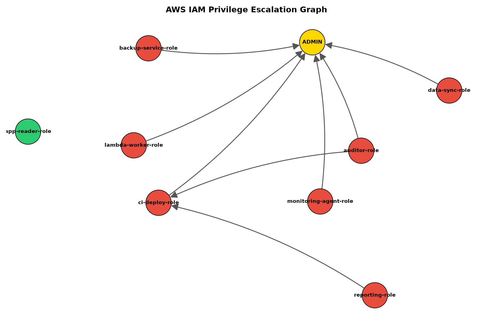

# NHI Escalation Scanner

🎥 Watch the demo - https://www.linkedin.com/posts/harsh-kam_cybersecurity-aws-cloudsecurity-activity-7483080878160699392-DzPx?utm_source=share&utm_medium=member_desktop&rcm=ACoAAEfxOfoBAXe5-pdwrnFLso4_ahpGY0D6KIE


*Red nodes are roles with a path to admin access (direct or chained). Green nodes are safe. The gold node represents admin access — every arrow shows a real, detected escalation route. Note `reporting-role`, which has no direct path but reaches admin through `ci-deploy-role` — a two-hop chain invisible to single-permission scanners.*

A privilege escalation path-finder for AWS **non-human identities** (IAM roles, service accounts) — built to catch hidden routes to admin access that traditional checklist-style scanners miss.

## The Problem

AWS permissions don't just grant access directly — they can be *chained*. A role that looks harmless on its own can sometimes combine a few individually-small permissions to reach full administrator access, without anyone explicitly granting it.

This is especially dangerous for **workload identities** — the roles used by CI/CD pipelines, Lambda functions, and other automated services — because they're rarely audited as carefully as human user accounts. According to industry research, a large share of machine identities in real organizations carry privileged access, often without a clear owner.

**Example:** a role with only `iam:PassRole` permission looks harmless in isolation. But if it's scoped to pass a *specific* role that itself has a known escalation path, the "harmless" role inherits that risk indirectly — a two-hop chain that a simple permission checklist would never catch.

## What It Does

This tool scans an AWS account's IAM roles and:

1. **Reads** every role's permissions
2. **Checks** them against 6 documented, real-world AWS privilege escalation techniques
3. **Traces multi-hop chains** using graph theory — not just "does this role have a dangerous permission," but "can this role reach admin through any combination of steps, direct or indirect"
4. **Reports** the exact path an attacker would take, step by step

## Example Output

```
⚠️  reporting-role  —  escalation path found [CHAINED (2 hops)]
    Permissions: ['iam:PassRole']
    Path: reporting-role -> ci-deploy-role -> ADMIN
```

`reporting-role` has exactly one permission, and no single pattern matches it directly. But it can pass control of `ci-deploy-role` — which *does* have a direct escalation path — so the tool correctly identifies that `reporting-role` can indirectly reach admin too.

## Escalation Patterns Detected

| Pattern | How it works |
|---|---|
| `iam:CreatePolicyVersion` | Rewrite an attached policy to grant full admin |
| `iam:AttachRolePolicy` | Attach AWS's built-in AdministratorAccess policy directly |
| `iam:PutRolePolicy` | Write a brand new admin-granting inline policy |
| `iam:UpdateAssumeRolePolicy` | Add yourself as a trusted user of a more privileged role |
| `iam:CreateAccessKey` | Generate credentials for a more privileged user |
| `iam:PassRole` + `lambda:CreateFunction` | Run code under a more privileged role via Lambda |

## How It Works

```
AWS account  →  Collector  →  Pattern Matcher  →  Graph Engine  →  Report
              (reads perms)   (checks known      (traces direct
                               attack tricks)      + chained paths)
```

- **`scanner/collector.py`** — reads IAM roles and flattens their permissions into a simple structure
- **`scanner/patterns.py`** — the knowledge base of known escalation techniques
- **`scanner/graph.py`** — builds a directed graph of role relationships and searches for any path (direct or multi-hop) to admin, using `networkx`
- **`scan.py`** — runs the full pipeline and prints a readable report

## Setup

```bash
git clone https://github.com/harshh211/nhi-escalation-scanner.git
cd nhi-escalation-scanner
python3 -m venv venv
source venv/bin/activate
pip install -r requirements.txt
```

## Usage

**Run against a safe, built-in test environment** (no AWS account needed — uses `moto` to simulate AWS):

```bash
python3 scan.py
```

**Run against a real AWS account** (requires read-only IAM credentials configured via `aws configure` or `~/.aws/credentials`):

```bash
python3 scan.py --real
```

This tool only performs read operations (`list_roles`, `get_role_policy`, etc.) — it cannot create, modify, or delete anything in your AWS account.

## Why I Built This

Most CSPM (Cloud Security Posture Management) tools check individual misconfigurations in isolation — "is this bucket public," "is MFA enabled." This project takes a different approach, closer to how an attacker actually thinks: not "what's misconfigured," but "what's *reachable*." Non-human identities in particular are an underexamined attack surface — they don't get MFA prompts, they're rarely reviewed manually, and they often accumulate permissions over time without cleanup.

## Roadmap

- [ ] Expand to 15-20+ documented escalation patterns
- [ ] Multi-account / cross-account escalation detection
- [ ] Severity scoring based on path length and permission scope
- [ ] Visual graph output
- [ ] Remediation suggestions per finding
